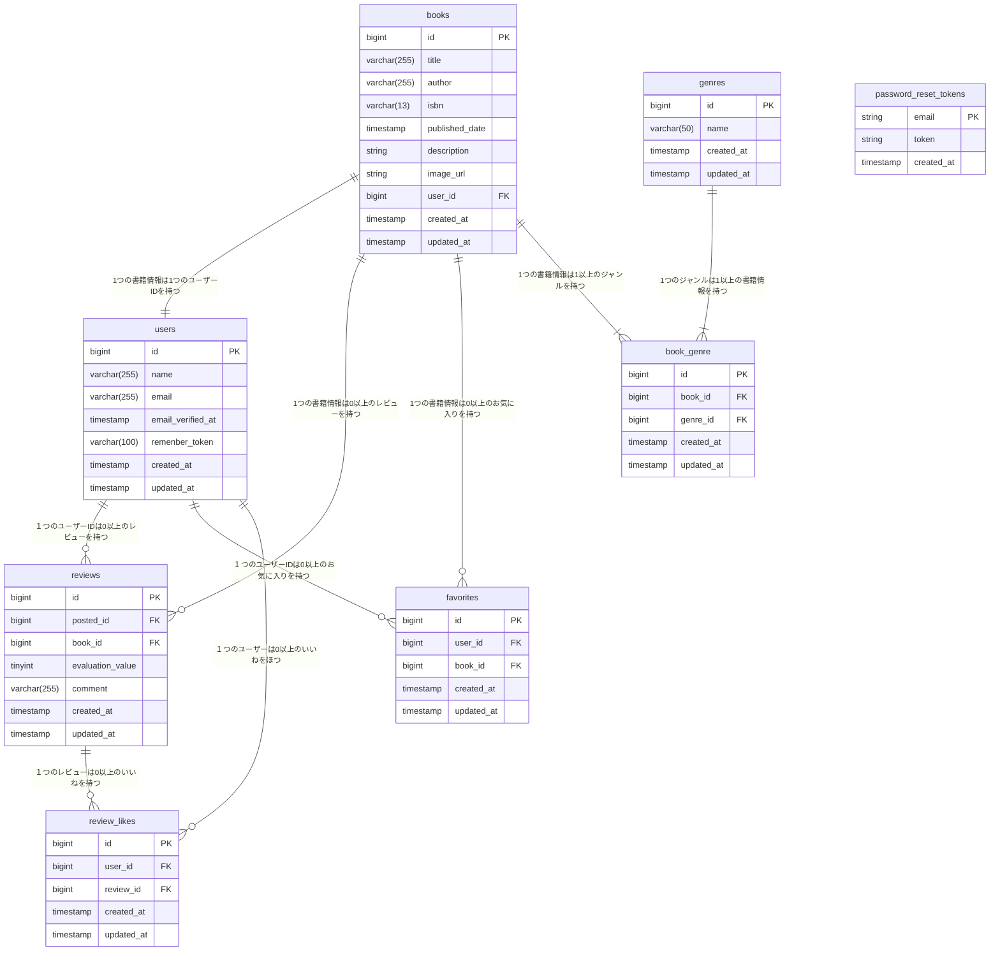

```mermaid
erDiagram
  books ||--|| users : "1つの書籍情報は1つのユーザーIDを持つ"
  books ||--o{ reviews : "1つの書籍情報は0以上のレビューを持つ"
  books ||--o{ favorites : "1つの書籍情報は0以上のお気に入りを持つ"
  books ||--|{ book_genre : "1つの書籍情報は1以上のジャンルを持つ"
  genres ||--|{ book_genre : "1つのジャンルは1以上の書籍情報を持つ"
  users ||--o{ reviews : "１つのユーザーIDは0以上のレビューを持つ"
  users ||--o{ favorites : "１つのユーザーIDは0以上のお気に入りを持つ"
  users ||--o{ review_likes : "１つのユーザーは0以上のいいねをほつ"
  reviews ||--o{ review_likes : "１つのレビューは0以上のいいねを持つ"

  users {
    bigint          id                  PK
    varchar(255)    name
    varchar(255)    email
    timestamp       email_verified_at
    varchar(100)    remenber_token
    timestamp       created_at
    timestamp       updated_at
  }

  books {
    bigint          id                  PK
    varchar(255)    title
    varchar(255)    author
    varchar(13)     isbn
    timestamp       published_date
    string          description
    string          image_url
    bigint          user_id             FK
    timestamp       created_at
    timestamp       updated_at
  }

  genres {
    bigint          id                  PK
    varchar(50)     name
    timestamp       created_at
    timestamp       updated_at
  }

  reviews {
    bigint          id                  PK
    bigint          posted_id           FK
    bigint          book_id             FK
    tinyint         evaluation_value
    varchar(255)    comment
    timestamp       created_at
    timestamp       updated_at
  }

  book_genre {
    bigint          id                  PK
    bigint          book_id             FK
    bigint          genre_id            FK
    timestamp       created_at
    timestamp       updated_at
  }

  favorites {
    bigint          id                  PK
    bigint          user_id             FK
    bigint          book_id             FK
    timestamp       created_at
    timestamp       updated_at
  }

  review_likes {
    bigint          id                  PK
    bigint          user_id             FK
    bigint          review_id           FK
    timestamp       created_at
    timestamp       updated_at
  }

  password_reset_tokens {
    string          email               PK
    string          token
    timestamp       created_at
  }

```
