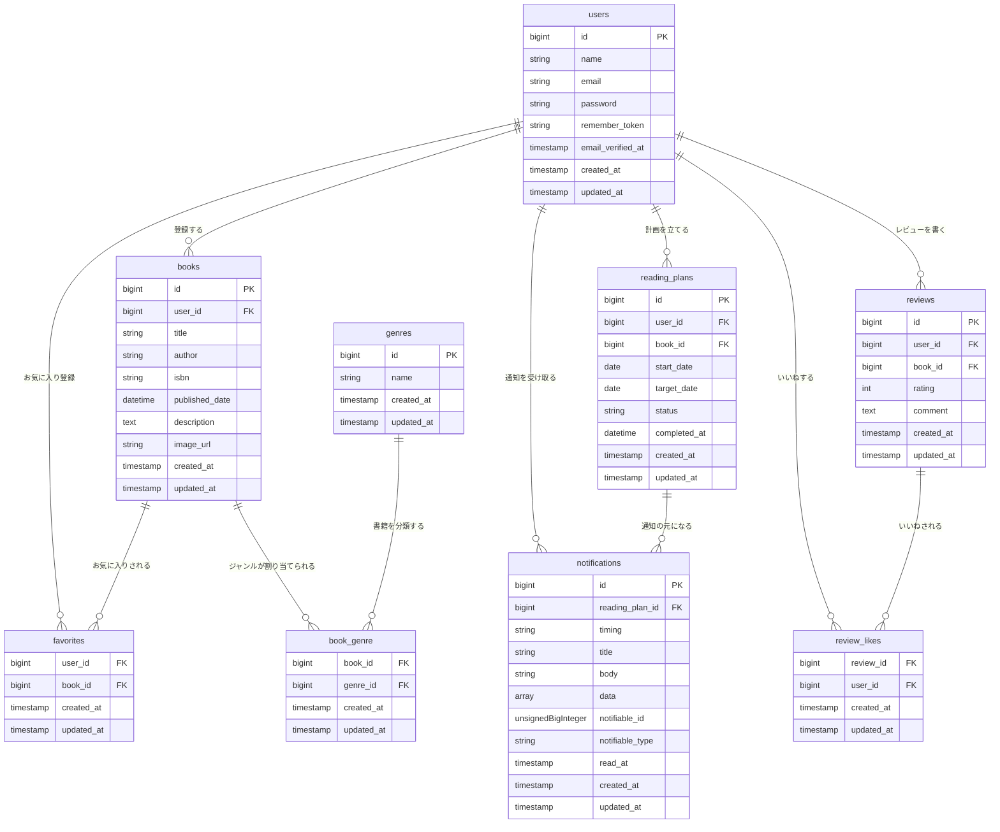

```mermaid

erDiagram
    users ||--o{ books : "登録する"
    users ||--o{ reading_plans : "計画を立てる"
    users ||--o{ reviews : "レビューを書く"
    users ||--o{ notifications : "通知を受け取る"
    reading_plans ||--o{ notifications : "通知の元になる"

    %% 中間テーブル favorites のリンク接続
    users ||--o{ favorites : "お気に入り登録"
    books ||--o{ favorites : "お気に入りされる"

    %% 中間テーブル review_likes のリンク接続
    users ||--o{ review_likes : "いいねする"
    reviews ||--o{ review_likes : "いいねされる"

    %% 中間テーブル book_genre のリンク接続
    books ||--o{ book_genre : "ジャンルが割り当てられる"
    genres ||--o{ book_genre : "書籍を分類する"


    users {
        bigint id PK
        string name
        string email
        string password
        string remember_token
        timestamp email_verified_at
        timestamp created_at
        timestamp updated_at
    }

    books {
        bigint id PK
        bigint user_id FK
        string title
        string author
        string isbn
        datetime published_date
        text description
        string image_url
        timestamp created_at
        timestamp updated_at
    }

    genres {
        bigint id PK
        string name
        timestamp created_at
        timestamp updated_at
    }

    book_genre {
        bigint book_id FK
        bigint genre_id FK
        timestamp created_at
        timestamp updated_at
    }

    favorites {
        bigint user_id FK
        bigint book_id FK
        timestamp created_at
        timestamp updated_at
    }

    reading_plans {
        bigint id PK
        bigint user_id FK
        bigint book_id FK
        date start_date
        date target_date
        string status
        datetime completed_at
        timestamp created_at
        timestamp updated_at
    }

    reviews {
        bigint id PK
        bigint user_id FK
        bigint book_id FK
        int rating
        text comment
        timestamp created_at
        timestamp updated_at
    }

    review_likes {
        bigint review_id FK
        bigint user_id FK
        timestamp created_at
        timestamp updated_at
    }

    notifications {
        bigint id PK
        bigint reading_plan_id FK
        string timing
        string title
        string body
        array data
        unsignedBigInteger notifiable_id
        string notifiable_type
        timestamp read_at
        timestamp created_at
        timestamp updated_at
    }

```
