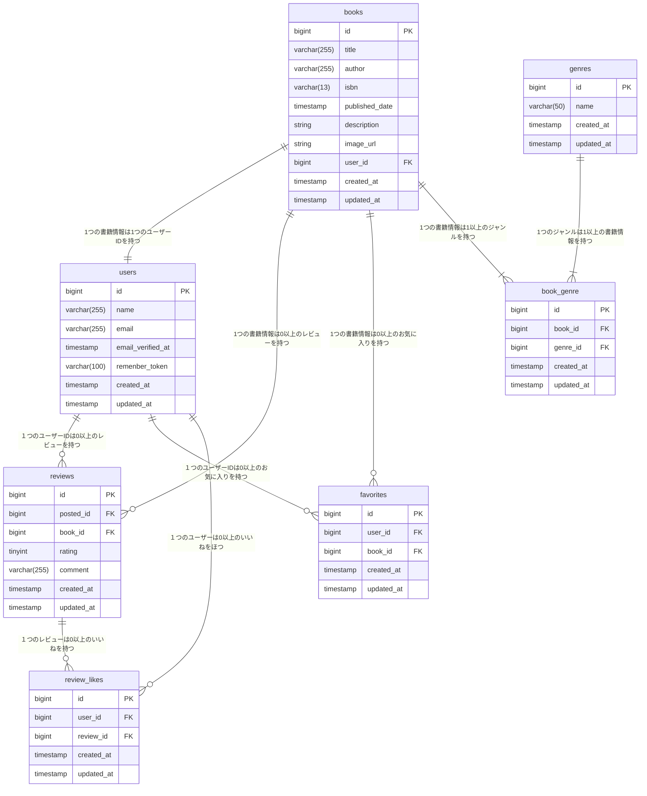

# 模擬案件_書籍レビューアプリBookShelf

## A.プロジェクト名
BookShelf 書籍レビューアプリ


### 開発者

森　太

## B.概要

### システム概要
本システムは、書籍レビューアプリケーション「BookShelf」です。<br>
ユーザーは書籍を登録・閲覧し、レビューの投稿やお気に入り登録ができます。<br>
ジャンルによる分類やレビューへのいいね機能、平均評価に基づくランキング機能も備えています。<br>
外部アプリケーション向けの公開API（JSON）も提供します。<br>

### 機能
提示された「新模擬案件_BookShelf_要件シート」を基に以下の機能を実装しました。<br>
**なお、bladeファイルは要件シートの指示通りGitHubにて提供されました。**

- 書籍一覧画面<br>
　 <http://localhost/books> で表示。<br>
　 データベースに登録してある書籍を1ページ10件でページネーションして表示。
　 未ログインか長時間アクセスしていないとログイン画面に遷移。

- 書籍詳細画面<br>
　 書籍名または書籍画像をクリックすると、選択した書籍の詳細情報が表示される。<br>
　 自分が登録した書籍のみ「編集」・「削除」ボタンが表示される。<br>
　 「編集」ボタンを押すと書籍情報編集画面に遷移。

- 書籍情報作成画面<br>
　 書籍一覧画面の「書籍の登録」ボタンで書籍登録画面を表示。<br>
　 入力する書籍情報は、書籍名・著者・ISBNコード・出版日・書籍の説明・画像URL・ジャンル。<br>
　 書籍説明と画像URLは空欄のままでもOK。<br>
　 登録ボタンで入力チェックし、成功すればbooksデータベースに保存。<br>
　 入力エラーの場合はエラー箇所に応じたエラーメッセージを表示。

- 書籍情報編集画面<br>
　 書籍詳細画面の編集ボタンで表示。<br>
　 登録済みの書籍情報を初期表示。<br>
　 編集項目は書籍情報作成画面と同じ。<br>
　 更新ボタンで入力チェックし、成功すればbooksデータベースを更新。<BR>
　 入力エラーの場合はエラー箇所に応じたエラーメッセージを表示。

- お気に入りトグル<br>
　 書籍詳細画面のハートマークで操作。<br>
　 消灯状態でクリックするとfavoritesテーブルに書籍IDとユーザーIDを保存。<br>
　 点灯状態でクリックするとfavoritesテーブルから削除。

- レビュー登録<br>
　 書籍詳細情報の下に表示されている。<br>
　 評価ドロップダウンリストから評価点を５段階で選択。<br>
　 コメントと評価点を入力して「投稿する」ボタンを押すと、入力内容をチェック後にreviewsテーブルに登録。<br>
　 入力エラーの場合はエラー箇所に応じたエラーメッセージを表示。

- いいねトグル<br>
　 レビュー一覧のサムズアップアイコンで操作。<br>
　 消灯状態でクリックするとreview_likesテーブルにレビューIDとユーザーIDを保存。<br>
　 点灯状態でクリックするとreview_likesテーブルから削除。

- ログイン画面<br>
　 未ログイン状態で各画面から遷移してきて表示。<br>
　 <http://localhost/login> でも表示可能.。
　 usersテーブルに保存してあるメールアドレス＋パスワードを入力してログイン。<br>
　 ログイン後は書籍一覧画面に遷移。<br>
　 ログイン画面の会員登録ボタンを押すと会員登録画面に遷移。

- 会員登録画面<br>
　 ログインの会員登録ボタンから遷移。もしくは<http://localhost/register> でも表示。<br>
　 登録ボタンで管理者ユーザ情報をusersテーブルに保存し、書籍一覧画面に遷移。

- ランキング画面<br>
　 ナビゲーションメニューのランキングをクリックすると表示。<br>
　 各書籍に対し、登録ユーザーがつけた評価点を基に平均評価点を計算し、トップ10を表示。

- お気に入り一覧画面<br>
　 ナビゲーションメニューのお気に入りをクリックすると表示。<br>
　 ログインユーザがお気に入りを設定した書籍一覧を表示。<br>
　 表示された書籍名か画像をクリックすると書籍詳細表示画面に遷移。<br>
　 未ログインの場合はログイン画面に遷移。

- ジャンル管理画面<br>
　 ナビゲーションメニューのジャンル管理をクリックすると表示。<br>
　 genresテーブルに登録しているジャンル名を一覧表示。<br>
　 「ジャンルを登録」ボタンをクリックするとジャンル登録画面に遷移。<br>
　 一覧表示の編集ボタンをクリックするとジャンル編集画面に遷移。<br>
　 一覧表示の削除ボタンをクリックするとジャンルを削除。

- ユーザーメニュー<br>
　 ナビゲーションメニューに現在ログインしているユーザー名を表示。<br>
　 ユーザー名をクリックするとログアウトボタンが表示され、ログアウトするとログイン画面に遷移。

- 書籍関連の公開API<br>
　 - エンドポイント：GET /api/v1/books：書籍一覧の取得。ページネーションあり。<br>
　 - エンドポイント：GET /api/v1/books/{book}：指定レコードの書籍詳細取得。<br>
　 - エンドポイント：POST /api/v1/books：書籍情報の新規登録。<br>
　 - エンドポイント：PUT /api/v1/books/{book}'：指定レコードの書籍情報の更新。<br>
　 - エンドポイント：DELETE /api/v1/books/{book}：指定レコードの書籍情報の削除。<br>
<br>

## C.ＥＲ図



<br>


## D.使用技術

- OS：mscOS Tahoe 26.5.2(CPU:Apple M4)
- PHP：8.5.7
- Laravel：10.50.2
- DB：MySQL 8.4.9
- Webサーバ：Apache 2.4.67
- フロントエンド：Vite 5.4.21、Tailwind CSS 3.4.19
- 開発ツール：Docker compose v5.1.4、sail 8.5、phpMyAdmin 5.2.3

<br>

## E.開発環境構築

提出した書籍レビューアプリBookShelfからの`git clone`で作成していきます。

### 1.使用コマンド

- クローンを作るホームディレクトリに移動（例）
```
cd ~/coachtech/新模擬案件
```

- `git`イメージのクローン<br>
　 実行するとホームディレクトリ直下に`bookshelf-app`フォルダが作られます。<br>
　 作成された`bookshelf-app`がプロジェクトディレクトリになります。
```
git clone git@githob.com:fm5889rx/bookshelf-app.git bookshelf-app
```

- Laravel Sailをインストール
```
# プロジェクトディレクトリに移動
cd BookShelf-app

# Laravel sail をインストール
docker run --rm \
    -u "$(id -u):$(id -g)" \
    -v "$(pwd):/var/www/html" \
    -w /var/www/html \
    -e COMPOSER_CACHE_DIR=/tmp/composer_cache \
    laravelsail/php82-composer:latest \
    composer require laravel/sail --dev
```

- .envファイルのコピー
```
cp .env.example .env
```

- Sailの設定ファイルをパブリッシュ（MySQLを選択）
```
docker run --rm \
    -u "$(id -u):$(id -g)" \
    -v "$(pwd):/var/www/html" \
    -w /var/www/html \
    -e COMPOSER_CACHE_DIR=/tmp/composer_cache \
    laravelsail/php82-composer:latest \
    php artisan sail:install --with=mysql
```

- `.env`ファイルの確認<br>
　 `SHIFT＋COMMAND＋"."`を同時に押して不可視ファイルを表示できるようにします。<br>
　 内容が違っていたら、以下のように修正します。<br>
　 確認・修正が終わったら再び`SHIFT＋COMMAND＋"."`を同時に押して不可視ファイルを非表示に切り替えます。
```
DB_CONNECTION=mysql
DB_HOST=mysql
DB_PORT=3306
DB_DATABASE=laravel
DB_USERNAME=sail
DB_PASSWORD=password
```

- エイリアス登録

```
echo "alias sail='[ -f sail ] && bash sail || bash vendor/bin/sail'" >> ~/.zshrc
```

- Sailの起動<br>
　 ※エイリアス登録済みとして記述
```
sail up -d
```

- アプリケーションキーの登録
```
sail artisan key:generate
```

- Laravel Sanctumのマイグレーションファイルを公開
```
sail artisan vendor:publish --tag="sanctum-migration"
```

- データベースの初期構築
```
# マイグレーション実行
sail artisan migrate:fresh

# Seeder実行
sail artisan db:seed
```

- 開発サーバのインストール
```
sail npm install
```

- 開発サーバの起動<br>
bladeファイルを表示する時は、バックグラウンドで開発サーバを常時動かしておく必要があります。
1. 開発用コマンドプロンプトとは別のコマンドプロンプトを起動
2. 以下のコマンドを入力
```
# プロジェクトディレクトリに移動
cd ~/coachtech/新模擬案件/bookshelf-app

# Vite開発サーバーの起動
sail npm run dev
```

- リポジトリの新規作成
1. ブラウザで`http://github.com`にアクセスし、自分のアカウントにログインする。
2. `＋`メニューから`New Repository`をクリックする。
3. リポジトリ名を`bookshelf-app`にする。
4. Descriptionは入力しないか、後でアプリ概要がわかるようにアプリ名を日本語で記述。
5. `public`/`Private`は`Public`のままにする。
6. `Create repository`ボタンをクリックする。
7. `Quick setup`の`SSH`ボタンを押してから、右に表示しているURL文字列をコピーする。
8. ターミナルから以下のコマンドを**順番に**実行する。
   ```
   git init
   git remote remove origin
   git remote add origin git@github.com:fm5889rx/bookshelf-app
   git remote -v
   ```
   **↓**
   ```
   origin <git@githob.com>:fx5889rx/bookshelf-app.git (fetch)
   origin <git@githob.com>:fx5889rx/bookshelf-app.git (push)
   ```

9. リポジトリの反映
ターミナルから以下のコマンドを**順番に**実行します。
   ```
   git add .
   git commit -m "git clone後の開発環境構築"
   git push origin main
   ```
10. GitHubでREADME.meを確認します。

### 2.動作確認

- Laravelの動作確認
ブラウザで`http://localhost`にアクセスし、お問い合わせ入力フォームが表示されることを確認。

- phpMyAdninの動作確認
ブラウザで`http://localhost:8080`にアクセスし、phpMyAdminが表示されていることを確認。

