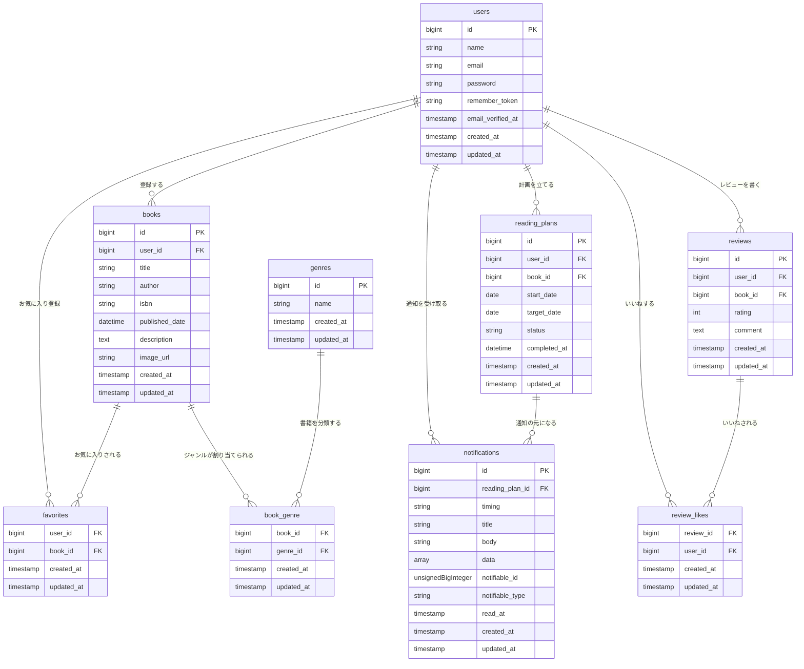

# 新模擬案件_書籍レビューアプリBookShelf

## A.プロジェクト名
BookShelf 書籍レビューアプリ


### 開発者

森　太

## B.概要

### システム概要
本システムは、書籍レビューアプリケーション「BookShelf」です。<br>
ユーザーは書籍を登録・閲覧し、レビューの投稿やお気に入り登録ができます。<br>
ジャンルによる分類やレビューへのいいね機能、平均評価に基づくランキング機能も備えています。<br>
外部アプリケーション向けの公開API（JSON）も提供します。<br>

### 機能
提示された「新模擬案件_BookShelf_要件シート」を基に以下の機能を実装しました。<br>
**なお、bladeファイルは要件シートの指示通りGitHubにて提供されました。**

- 書籍一覧画面<br>
　 <http://localhost/books> で表示。<br>
　 データベースに登録してある書籍を1ページ10件でページネーションして表示。<br>
　 未ログインか長時間アクセスしていないとログイン画面に遷移。<br>
　 【応用】クエリパラメータにキーワード（keyword）・ジャンル（genre）・ソート順（newest／oldest／rating／title）を<br>
　 付けてリクエストすると条件成立した書籍だけ表示。

- 書籍詳細画面<br>
　 書籍名または書籍画像をクリックすると、選択した書籍の詳細情報が表示される。<br>
　 自分が登録した書籍のみ「編集」・「削除」ボタンが表示される。<br>
　 「編集」ボタンを押すと書籍情報編集画面に遷移。

- 書籍情報作成画面<br>
　 書籍一覧画面の「書籍の登録」ボタンで書籍登録画面を表示。<br>
　 入力する書籍情報は、書籍名・著者・ISBNコード・出版日・書籍の説明・画像URL・ジャンル。<br>
　 書籍説明と画像URLは空欄のままでもOK。<br>
　 登録ボタンで入力チェックし、成功すればbooksデータベースに保存。<br>
　 入力エラーの場合はエラー箇所に応じたエラーメッセージを表示。<br>
　 【応用】ISBNコード検索でGoogle Books APIを通じて書籍情報を取得。

- 書籍情報編集画面<br>
　 書籍詳細画面の編集ボタンで表示。<br>
　 登録済みの書籍情報を初期表示。<br>
　 編集項目は書籍情報作成画面と同じ。<br>
　 更新ボタンで入力チェックし、成功すればbooksデータベースを更新。<BR>
　 入力エラーの場合はエラー箇所に応じたエラーメッセージを表示。
　 【応用】ISBNコード検索でGoogle Books APIを通じて書籍情報を取得。

- お気に入りトグル<br>
　 書籍詳細画面のハートマークで操作。<br>
　 消灯状態でクリックするとfavoritesテーブルに書籍IDとユーザーIDを保存。<br>
　 点灯状態でクリックするとfavoritesテーブルから削除。

- レビュー登録<br>
　 書籍詳細情報の下に表示されている。<br>
　 評価ドロップダウンリストから評価点を５段階で選択。<br>
　 コメントと評価点を入力して「投稿する」ボタンを押すと、入力内容をチェック後にreviewsテーブルに登録。<br>
　 入力エラーの場合はエラー箇所に応じたエラーメッセージを表示。

- いいねトグル<br>
　 レビュー一覧のサムズアップアイコンで操作。<br>
　 消灯状態でクリックするとreview_likesテーブルにレビューIDとユーザーIDを保存。<br>
　 点灯状態でクリックするとreview_likesテーブルから削除。

- ログイン画面<br>
　 未ログイン状態で各画面から遷移してきて表示。<br>
　 <http://localhost/login> でも表示可能.。
　 usersテーブルに保存してあるメールアドレス＋パスワードを入力してログイン。<br>
　 ログイン後は書籍一覧画面に遷移。<br>
　 ログイン画面の会員登録ボタンを押すと会員登録画面に遷移。

- 会員登録画面<br>
　 ログインの会員登録ボタンから遷移。もしくは<http://localhost/register> でも表示。<br>
　 登録ボタンで管理者ユーザ情報をusersテーブルに保存し、書籍一覧画面に遷移。

- ランキング画面<br>
　 ナビゲーションメニューのランキングをクリックすると表示。<br>
　 各書籍に対し、登録ユーザーがつけた評価点を基に平均評価点を計算し、トップ10を表示。

- お気に入り一覧画面<br>
　 ナビゲーションメニューのお気に入りをクリックすると表示。<br>
　 ログインユーザがお気に入りを設定した書籍一覧を表示。<br>
　 表示された書籍名か画像をクリックすると書籍詳細表示画面に遷移。<br>
　 未ログインの場合はログイン画面に遷移。

- ジャンル管理画面<br>
　 ナビゲーションメニューのジャンル管理をクリックすると表示。<br>
　 genresテーブルに登録しているジャンル名を一覧表示。<br>
　 「ジャンルを登録」ボタンをクリックするとジャンル登録画面に遷移。<br>
　 一覧表示の編集ボタンをクリックするとジャンル編集画面に遷移。<br>
　 一覧表示の削除ボタンをクリックするとジャンルを削除。

- ユーザーメニュー<br>
　 ナビゲーションメニューに現在ログインしているユーザー名を表示。<br>
　 ユーザー名をクリックするとログアウトボタンが表示され、ログアウトするとログイン画面に遷移。

- 【応用】読書計画<br>
　 ナビゲーションメニューの読書計画をクリックすると表示。<br>
　 ユーザーが書籍ごとに読書スケジュールと進捗を管理するために使用。<br>
　 計画状態（未計画・未読書・読書中・読了・期限超過）を表示。<br>
　 計画の作成で書籍名と読了予定日を登録、読了前なら編集画面で読了完了日の変更と<br>
　 計画の削除が可能。<br>
　 読了するをクリックと状態が読了に変わり、計画自体の削除が可能。　<br>
　 書籍名をクリックすると書籍詳細画面に推移。

- 【応用】マイ読書レポート
　 ナビゲーションメニューのマイレポートをクリックすると表示。<br>
　 基本統計・評価分布・高評価書籍TOP5・ジャンル別評価傾向TOP5の分析データを表示。<br>
　 各統計データはコントローラ内で計算。

- 【応用】通知機能
　 ナビゲーションメニューのベルアイコンをクリックすると表示。<br>
　 読書計画の進捗状況をユーザーへ知らせるための機能。
　 読了予定3日前・予定期日・期限3日以上経過でステータスアイコンの色と形が変化。<br>
　 既読にするをクリックすると読書中のアイコンに変化。

- 【応用】日次バッチ機能
　 通知の発行を完全自動化するための、アプリケーションのバックエンド基盤。<br>
　 Laravelのスケジュール機能を使って、毎日20:00にステータス更新。<br>
　 （スケジュール起動は１分ごと）<br>
　 - 期日経過計画の一括ステータス変更（Active→Expired）<br>
　 - 期日3日前（予告通知）：3日前になった読書中の計画に対しリマインダー通知を自動発火<br>
　 - 期日当日：期日当日になった読書中の計画に対し、完了を促す最終通知を自動発火<br>
　 - 期日3日後：期日超過になって3日経過した計画に対し、再計画促す通知を自動発火

- 書籍関連の公開API【応用あり】<br>
　 - エンドポイント：GET /api/v1/books：書籍一覧の取得。ページネーションあり。<br>
　 - エンドポイント：GET /api/v1/books/{book}：指定レコードの書籍詳細取得<br>
　 - エンドポイント：POST /api/v1/books：書籍情報の新規登録。【応用】事前にSanctumトークンの入手が必要<br>
　 - エンドポイント：PUT /api/v1/books/{book}'：指定レコード【応用】の書籍情報の更新。事前にSanctumトークンの入手が必要<br>
　 - エンドポイント：DELETE /api/v1/books/{book}：指定レコードの書籍情報の削除。【応用】事前にSanctumトークンの入手が必要<br>
　 - 【応用】エンドポイント：POST /api/v1/login：Sanctumトークン取得
<br>

## C.ＥＲ図


```mermaid
erDiagram
    users ||--o{ books : "登録する"
    users ||--o{ reading_plans : "計画を立てる"
    users ||--o{ reviews : "レビューを書く"
    users ||--o{ notifications : "通知を受け取る"
    reading_plans ||--o{ notifications : "通知の元になる"

    %% 中間テーブル favorites のリンク接続
    users ||--o{ favorites : "お気に入り登録"
    books ||--o{ favorites : "お気に入りされる"

    %% 中間テーブル review_likes のリンク接続
    users ||--o{ review_likes : "いいねする"
    reviews ||--o{ review_likes : "いいねされる"

    %% 中間テーブル book_genre のリンク接続
    books ||--o{ book_genre : "ジャンルが割り当てられる"
    genres ||--o{ book_genre : "書籍を分類する"


    users {
        bigint id PK
        string name
        string email
        string password
        string remember_token
        timestamp email_verified_at
        timestamp created_at
        timestamp updated_at
    }

    books {
        bigint id PK
        bigint user_id FK
        string title
        string author
        string isbn
        datetime published_date
        text description
        string image_url
        timestamp created_at
        timestamp updated_at
    }

    genres {
        bigint id PK
        string name
        timestamp created_at
        timestamp updated_at
    }

    book_genre {
        bigint book_id FK
        bigint genre_id FK
        timestamp created_at
        timestamp updated_at
    }

    favorites {
        bigint user_id FK
        bigint book_id FK
        timestamp created_at
        timestamp updated_at
    }

    reading_plans {
        bigint id PK
        bigint user_id FK
        bigint book_id FK
        date start_date
        date target_date
        string status
        datetime completed_at
        timestamp created_at
        timestamp updated_at
    }

    reviews {
        bigint id PK
        bigint user_id FK
        bigint book_id FK
        int rating
        text comment
        timestamp created_at
        timestamp updated_at
    }

    review_likes {
        bigint review_id FK
        bigint user_id FK
        timestamp created_at
        timestamp updated_at
    }

    notifications {
        bigint id PK
        bigint reading_plan_id FK
        string timing
        string title
        string body
        array data
        unsignedBigInteger notifiable_id
        string notifiable_type
        timestamp read_at
        timestamp created_at
        timestamp updated_at
    }

```

<br>


## D.使用技術

- OS：mscOS Tahoe 26.5.2(CPU:Apple M4)
- PHP：8.5.7
- Laravel：10.50.2
- DB：MySQL 8.4.9
- Webサーバ：Apache 2.4.67
- フロントエンド：Vite 5.4.21、Tailwind CSS 3.4.19
- 開発ツール：Docker compose v5.1.4、sail 8.5、phpMyAdmin 5.2.3

<br>
<br>

## E.開発環境構築

提出した書籍レビューアプリBookShelfからの`git clone`で作成していく。

### 1.使用コマンド

- クローンを作るホームディレクトリに移動（例）
```
cd ~/coachtech/新模擬案件
```
　 ホームディレクトリを作るには以下のコマンドを実行
```
mkdir 新模擬案件
cd 新模擬案件
```

- `git`イメージのクローン<br>
　 実行するとホームディレクトリ直下に`bookshelf-app`フォルダが作られる。<br>
　 作成された`bookshelf-app`がプロジェクトディレクトリになる。
```
git clone https://github.com/fm5889rx/BookShelf-app.git
```

- Laravel Sailをインストール
```
# プロジェクトディレクトリに移動
cd BookShelf-app

# Laravel sail をインストール
docker run --rm \
    -u "$(id -u):$(id -g)" \
    -v "$(pwd):/var/www/html" \
    -w /var/www/html \
    -e COMPOSER_CACHE_DIR=/tmp/composer_cache \
    laravelsail/php82-composer:latest \
    composer require laravel/sail --dev
```

- .envファイルのコピー
```
cp .env.example .env
```

- Sailの設定ファイルをパブリッシュ（MySQLを選択）
```
docker run --rm \
    -u "$(id -u):$(id -g)" \
    -v "$(pwd):/var/www/html" \
    -w /var/www/html \
    -e COMPOSER_CACHE_DIR=/tmp/composer_cache \
    laravelsail/php82-composer:latest \
    php artisan sail:install --with=mysql
```

- `.env`ファイルの確認<br>
　 `SHIFT＋COMMAND＋"."`を同時に押して不可視ファイルを表示できるようにする。<br>
　 内容が違っていたら、以下のように修正する。<br>
　 確認・修正・保存が終わったら、再び`SHIFT＋COMMAND＋"."`を同時に押して不可視ファイルを非表示に切り替える。
```
DB_CONNECTION=mysql
DB_HOST=mysql
DB_PORT=3306
DB_DATABASE=laravel
DB_USERNAME=sail
DB_PASSWORD=password

GOOGLE_BOOKS_API_KEY="あなたのGoogleBooksAPIキーを設定してください"
```

- エイリアス登録

```
echo "alias sail='[ -f sail ] && bash sail || bash vendor/bin/sail'" >> ~/.zshrc
```

- Sailの起動<br>
　 ※エイリアス登録済みとして記述
```
sail up -d
```

- アプリケーションキーの登録
```
sail artisan key:generate
```

- Laravel Sanctumのマイグレーションファイルを公開
```
sail artisan vendor:publish --tag="sanctum-migration"
```

- データベースの初期構築
```
# マイグレーション&シーダー実行
sail artisan migrate:fresh --seed
```

- 開発サーバのインストール
```
sail npm install
```

- 開発サーバの起動<br>
bladeファイルを表示する時は、バックグラウンドで開発サーバを常時動かしておく必要がある。
1. 開発用コマンドプロンプトとは別のコマンドプロンプトを起動
2. 以下のコマンドを入力
```
# プロジェクトディレクトリに移動
cd ~/coachtech/新模擬案件/bookshelf-app

# Vite開発サーバーの起動
sail npm run dev
```

- **正規の開発・本番環境におけるタスクスケジューラの設定（Cronの登録）**<br>
   本番環境および正規の開発サーバー環境において、Laravelのタスクスケジューラをバックグラウンドで1分ごとに自動起動させるため、サーバーのCron（クーロン）に以下の設定を追加する。

```
sail artisan schedule:run >> storage/logs/schedule.log 2>&1
```

<br>

### 2.動作確認

- Laravelの動作確認
　 ブラウザで`http://localhost`にアクセスし、お問い合わせ入力フォームが表示されることを確認。

- phpMyAdninの動作確認
　 ブラウザで`http://localhost:8080`にアクセスし、phpMyAdminが表示されていることを確認。

- スケジュール機能の確認
　 コンソールでjobsコマンドを実行。


<br>
<br>

## F. 実施テストの詳細レポート（合計200ケース Passed 達成）

本プロジェクトでは、アプリケーションの信頼性と堅牢性を担保するため、すべての主要機能に対して「正常系」「異常系」の自動テスト（Featureテスト・Unitテスト）を実装している。<br>
ターミナルで各フィルターコマンドを実行することで、それぞれの機能層のテストを個別に検証する。

現在、**合計200ケースのテストすべてが Passed（合格）** していることを確認済み。

<br>

### ① モデル・リレーション定義関連（Eloquent Relations）

データベースの構造と Eloquent モデルの繋がりが破綻していないかを検証するUnitテストを行う。

- **テスト内容**:
  - `Genre` モデルが中間テーブル（`book_genre`）を正しく経由し、所属する本のレビュー一覧（`reviews()`）を `BelongsToMany` 型でクエリ取得できることの検証。
  - `ReadingPlan` モデルが規約に準拠した複数形リレーション（`notifications()`）により、紐づく `Notification` レコードを `HasMany`（1対多）で正確に取得できることの検証。
  - `Notification` モデルから、親である `User`、`Book`、`ReadingPlan` の各モデルへ正しく `BelongsTo` 接続できることの検証。
- **実行コマンド**:

  ```
  sail artisan test --filter=ModelRelationTest
  ```

<br>

### ② フォームリクエスト・バリデーション関連（Validation）

リクエストデータの整合性を担保するバリデーションルールの検証を行う。

- **テスト内容**:
  - `StoreReviewRequest` や `UpdateReviewRequest` などのフォームリクエストに対し、正常値が渡された場合に正しくバリデーションを通過（`assertTrue($validator->passes())`）することの検証。
  - `ReadingPlan` 登録時、すでに同じ書籍が登録されている場合に重複エラーを検知し、セッションに入力値（`_old_input`）とエラーメッセージを保持して元の画面に `back()` で戻る異常系ルートの検証。
  - ※ `ReviewFactory` を最適化（`realText(50)` の日本語短文生成）したことで、文字数制限などのバリデーション境界値によるテストのランダムな失敗（Flaky Test）を完全に排除。
- **実行コマンド**:

  ```
  sail artisan test --filter=Validation
  ```

<br>

### ③ 読書計画管理・スケジュール関連（ReadingPlan & Batch）

読書計画のステータス管理や、タスクスケジューラによる日次自動リマインダーバッチの挙動をテストする。

- **テスト内容**:
  - 期日（`target_date`）経過した `Active` 計画が、バッチ実行時に自動で `Expired` ステータスへ一括更新（mass update）されることの検証。
  - 期日3日前（予告）、期日当日（最終リマインド）、期日3日後（再エンゲージメント）の各タイミングで、適切な通知が `DatabaseChannel` を経由して発火することの検証。
  - バッチコマンドが「毎日20時（`0 20 * * *`）」のスケジュール式で正しく登録されているかの検証。

- **実行コマンド**:
  ```
  sail artisan test --filter=UpdateReadingPlanTest
  ```

- **手動動作確認用コマンド（スケジューラの常駐化）**:
  ```
  # 1. 毎日20時の自動バッチ発火をエミュレートするため、まずコンテナ内部（シェル）にログインする
  sail shell

  # 2. コンテナ内部で出力をログファイルに完全隔離し、バックグラウンドで安全に常駐起動させる
  php artisan schedule:work >> storage/logs/schedule-work.log 2>&1 &

  # 3. 1分以上経過後、以下のコマンドでコンテナ内に正常な監視ログが刻まれていることを確認する
  cat storage/logs/schedule-work.log
  ```

<br>

### ④ 認証・ユーザー登録関連（Authentication & Fortify）

Laravel Fortify をベースとした、未ログインユーザーのアクセス制限やログイン・会員登録処理の検証を行う。

- **テスト内容**:
  - 読書計画一覧や書籍登録など、保護されたルートへ未ログインユーザーがアクセスした際、コントローラーのガード処理によって正しくリダイレクトされるかの制限検証。
  - ログインリクエスト時に、登録されたレートリミッター（`RateLimiter`）が正常に作動し、過度なアクセスを制限するロジックの検証。
- **実行コマンド**:

  ```
  sail artisan test --filter=AuthControllerTest
  ```

<br>

### ⑤ 書籍管理・外部API連携関連（Book & Google Books API）

書籍の一覧表示、新規登録、および外部APIと連携したISBN検索機能の検証を行う。

- **テスト内容**:
  - 書籍一覧画面において、リクエストパラメータ（`genre => 1`）に対して多対多のピボットテーブルでジャンルと結びついた書籍データが空にならず、10件単位で正確にページ分割（ページネーション）されてビューに渡るかの検証。
  - ISBN検索機能において、`Http::fake()` を用いて外部通信を物理的に完全遮断。正常にJSON（`volumeInfo`）を返す正常系ルートと、APIが500エラーを返した際にコントローラーが適切なエラーメッセージとコード（500/404）を返す異常系ルートの双方を検証。
  - Google Books APIから返ってきた著者名配列（`authors`）を、アプリ仕様である単数形文字列（`author`）へ正しくマッピング・詰め替え処理が行われているかの検証。
- **実行コマンド**:

  ```
  sail artisan test --filter=BookControllerTest
  ```

<br>

### ⑥ ジャンル管理関連（Genre & Categorization）

書籍に紐づくジャンルの表示や、ジャンルごとの書籍分類ロジックの検証を行う。

- **テスト内容**:
  - 管理画面や登録画面において、登録済みのジャンル一覧が正確に取得・表示されるかの検証。
  - 多対多（`book_genre`）で結びついたジャンルごとの書籍一覧の整合性検証。
- **実行コマンド**:

  ```
  sail artisan test --filter=GenreControllerTest
  ```

<br>

### ⑦ 通知機能・ログ関連（Notification Base）

リマインダー通知の発行履歴や、ユーザーへの通知スタンド機能の検証を行う。

- **テスト内容**:
  - `notifications` テーブルに保存された通知データが、ユーザーマイページなどの通知一覧画面へ正しくロードされるかの検証。
  - 既読処理（`read_at` の更新）がエラーなく安全に実行されるかの検証。
- **実行コマンド**:

  ```
  sail artisan test --filter=NotificationTest
  ```

<br>

### ⑧ 読書計画コントローラー（ReadingPlan Controller 追加検証）

読書計画の表示、登録における画面遷移や、より詳細なパラメータ制御の検証を行う。

- **テスト内容**:
  - 読書計画作成画面（`create`）および詳細画面（`show`）が正常に応答するかの検証。
  - 登録処理（`store`）実行後のリダイレクト処理およびセッションデータの検証。
- **実行コマンド**:

  ```
  sail artisan test --filter=ReadingPlanControllerTest
  ```

<br>

### ⑨ マイ読書レポート（Report & Analytics）

書籍全体の総レビュー数や、レビュー評価分析、書籍別／ジャンル別TOP5などの統計分析の検証を行う。

- **テスト内容**:
  - マイ読書レポートにおける「総レビュー数」「読了冊数」「レビュー評価別の冊数」「高評価書籍TOP5」「ジャンル別評価傾な向TOP5」などの集計ロジックの正確性検証。
  - データが0件の場合でも画面がクラッシュせず、正常に応答（200 OK）を返すかの検証。
- **実行コマンド**:

  ```
  sail artisan test --filter=ReportControllerTest
  ```

<br>

### ⑩ レビュー・評価管理関連（Review Controller）

書籍に対する評価（星の数）や、コメントの投稿・更新・削除の検証を行う。

- **テスト内容**:
  - `StoreReviewRequest` 等を通過したデータが、`reviews` テーブルへ正しくインサートされるかの検証。
  - 投稿済みのレビューに対する「いいね（`review_likes`）」の連動およびデータの整合性検証。
- **実行コマンド**:

  ```
  sail artisan test --filter=ReviewControllerTest
  ```

<br>

### ⑪ その他周辺機能（Other Functions）

上記に含まれないお気に入りトグル、いいねボタン、ランキング表示の検証を行う。。

- **テスト内容**:
  - お気に入りボタンがトグル動作し、`favolites`が適時更新されるかの検証。
  - レビュー一覧にあるいいねボタンのトグル動作と`review_likes`テーブルが適時更新されるかの検証。
  - 平均評価点TOP10の表示と書籍詳細画面へのリンクができることの検証。
- **実行コマンド**:

  ```
  sail artisan test --filter=OtherFunctionTest
  ```
<br>
